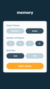
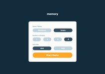
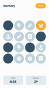
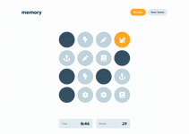
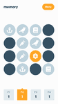
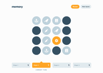
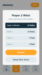
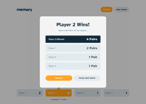

# Memory Game React App

This is a memory game built with React and Vite. The game allows users to play a memory matching game with different themes, grid sizes, and player settings.

## Table of Contents

- [Features](#features)
- [Screenshots](#screenshots)
- [Installation](#installation)
- [Usage](#usage)
- [Scripts](#scripts)
- [Configuration](#configuration)
- [Deployment](#deployment)
- [License](#license)

## Features

- **Single-player and multiplayer modes**: Play alone or with up to 3 other players.
- **Bots in multiplayer mode**: Add bots to play against in multiplayer mode.
- **Different themes**: Choose between Numbers and Icons themes for the cards.
- **Configurable grid sizes**: Select from 4x4 or 6x6 grid sizes for different levels of difficulty.
- **Responsive design**: The game is fully responsive and works on various screen sizes.
- **Timer and move counter**: Track the time taken and the number of moves made during the game.
- **Game over dialogs with results**: View the results and statistics at the end of the game, including the winner in multiplayer mode.

### Screenshots

Click to open the full-size screenshot.

| Mobile layout                                                                                                         | Desktop layout                                                                                                          | 
| --------------------------------------------------------------------------------------------------------------------- | ----------------------------------------------------------------------------------------------------------------------- |
| <a href="./screenshots/mobile-main.png"></a>                         | <a href="./screenshots/desktop-main.png"></a>                         |
| <a href="./screenshots/mobile-singleplayer.png"></a>         | <a href="./screenshots/desktop-singleplayer.png"></a>         |
| <a href="./screenshots/mobile-singleplayer-end.png"></a> | <a href="./screenshots/desktop-singleplayer-end.png"></a> |
| <a href="./screenshots/mobile-multiplayer.png"></a>           | <a href="./screenshots/desktop-multiplayer.png"></a>           |
| <a href="./screenshots/mobile-multiplayer-end.png"></a>   | <a href="./screenshots/desktop-multiplayer-end.png"></a>   |


## Installation

1. Clone the repository:

    ```sh
    git clone https://github.com/your-username/memory-game-react-app.git
    cd memory-game-react-app
    ```

2. Install the dependencies:

    ```sh
    npm install
    ```

## Usage

1. Start the development server:

    ```sh
    npm run dev
    ```

2. Open your browser and navigate to `http://localhost:3000`.

## Scripts

- `npm run dev`: Starts the development server.
- `npm run build`: Builds the project for production.
- `npm run lint`: Lints the codebase using ESLint.
- `npm run preview`: Previews the production build.

## Configuration

The project uses the following configuration files:

- [vite.config.js](http://_vscodecontentref_/1): Vite configuration.
- [tailwind.config.js](http://_vscodecontentref_/2): Tailwind CSS configuration.
- [postcss.config.js](http://_vscodecontentref_/3): PostCSS configuration.
- [eslint.config.js](http://_vscodecontentref_/4): ESLint configuration.

## Deployment

The project is configured to deploy to GitHub Pages using GitHub Actions. The deployment workflow is defined in [deploy.yml](http://_vscodecontentref_/5).

To deploy the project:

1. Push your changes to the [main](http://_vscodecontentref_/6) branch.
2. The GitHub Actions workflow will automatically build and deploy the project to GitHub Pages.

## License

This project is licensed under the MIT License.